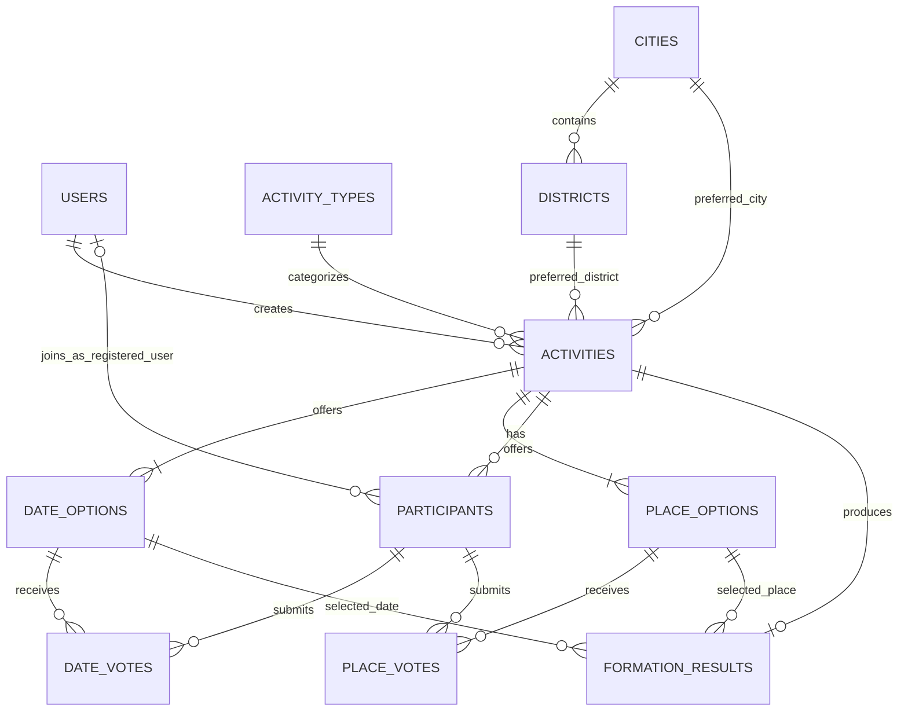

# 揪哪天？（Gathering Match）— 最小資料模型草案

最後更新：2026-08-27  
狀態：討論草案，尚未建立 Entity、Migration 或正式資料表

## 已確認的實作決策

- 主揪登入採 ASP.NET Core Identity，帳號 Entity 為 `ApplicationUser : IdentityUser<long>`。
- Identity 資料透過 EF Core 與 Npgsql 保存於 Supabase PostgreSQL，不使用 Supabase Auth。
- 第一階段採 `IdentityUserContext<ApplicationUser, long>`，不先加入 Roles／UserRoles。
- C# 與 PostgreSQL 資料表／欄位統一使用 PascalCase；手寫 PostgreSQL SQL 時須使用雙引號引用 PascalCase 名稱。
- 不加入 `EFCore.NamingConventions`。

## 1. 這份草案的範圍

這份資料模型先支援以下核心流程：

1. 主揪註冊及登入。
2. 主揪建立活動並設定候選日期與候選地點。
3. 朋友透過公開連結免註冊加入。
4. 朋友分別填寫日期與地點偏好。
5. 主揪查看回覆進度。
6. Deadline 後產生結算結果。

目前不包含：

- Google Places API 串接實作。
- 完整會員社群、好友或邀請名單。
- 通知與背景排程實作。
- Controller、API 契約與 DTO。
- EF Core Entity、Migration 或正式資料表。

## 2. 建議的資料表

| 階段 | 資料表 | 用途 |
| --- | --- | --- |
| 核心 | `AspNetUsers` | ASP.NET Core Identity 管理的主揪帳號與基本資料 |
| 核心 | `activity_types` | 活動類型下拉選項 |
| 核心 | `cities` | 台灣縣市參照資料 |
| 核心 | `districts` | 台灣鄉鎮市區參照資料 |
| 核心 | `activities` | 活動主資料、條件、Deadline 與狀態 |
| 核心 | `date_options` | 每場活動的候選日期／時間 |
| 核心 | `place_options` | 每場活動實際採用的候選地點 |
| 核心 | `participants` | 透過分享連結加入的免註冊參加者 |
| 核心 | `date_votes` | 參加者對候選日期的偏好 |
| 核心 | `place_votes` | 參加者對候選地點的偏好 |
| 核心 | `formation_results` | Deadline 結算結果與計算摘要 |
| V0.2 再評估 | `external_places` | 僅管理外部地點識別碼，不作完整 Google Places 永久快取 |

## 3. 關聯概覽

### 關聯的白話說明

- 一位 `user` 可以建立多場 `activity`。
- 一位 `user` 也可以在多場活動中成為 `participant`；免註冊參加者則沒有對應的 `user`。
- 一種 `activity_type` 可以被多場活動使用。
- 一個 `city` 包含多個 `district`。
- 一場 `activity` 有多個 `date_option`、`place_option` 與 `participant`。
- 一位 `participant` 可以對多個日期投票；一個日期也會收到多位參加者的票，因此由 `date_votes` 表示多對多關聯。
- 一位 `participant` 可以對多個地點投票；一個地點也會收到多位參加者的票，因此由 `place_votes` 表示多對多關聯。
- 一場活動第一版最多保留一筆正式 `formation_result`。

## 4. 欄位草案

> C# 屬性與 PostgreSQL 實際名稱均採 PascalCase。EF Core 會自動產生正確的雙引號 SQL；若手寫 SQL，也必須引用例如 `"AspNetUsers"`、`"DisplayName"`。

### 4.1 `AspNetUsers`／`ApplicationUser` — 主揪帳號

| 欄位 | PostgreSQL 型別 | 必填 | 限制／預設 | 說明 |
| --- | --- | --- | --- | --- |
| `Id` | `bigint` | 是 | PK、Identity | Identity 使用者編號 |
| `UserName`／`NormalizedUserName` | `text` | 由 Identity 管理 | Index／Unique Index | Identity 登入與正規化識別 |
| `Email`／`NormalizedEmail` | `text` | 由 Identity 管理 | Index | 登入 Email 與正規化 Email |
| `PasswordHash` | `text` | 由 Identity 管理 | 不保存明碼 | Identity 產生的密碼雜湊 |
| `DisplayName` | `varchar(50)` | 是 | NOT NULL | Gathering Match 新增的主揪顯示名稱，已完成 |
| `IsActive` | `boolean` | 是 | DEFAULT `true` | 帳號是否可用，尚未加入程式碼 |
| `CreatedAt` | `timestamptz` | 是 | UTC | 建立時間，尚未加入程式碼 |
| `UpdatedAt` | `timestamptz` | 是 | UTC | 最後更新時間，尚未加入程式碼 |

設計提醒：Identity 另會建立 UserClaims、UserLogins 與 UserTokens 等必要表。`Activities.HostUserId` 之後指向 `AspNetUsers.Id`；不自行實作密碼雜湊。

### 4.2 `activity_types` — 活動類型

| 欄位 | PostgreSQL 型別 | 必填 | 限制／預設 | 說明 |
| --- | --- | --- | --- | --- |
| `id` | `smallint` | 是 | PK、Identity | 類型編號 |
| `code` | `text` | 是 | UNIQUE | 穩定代碼，例如 `meal`、`coffee`、`outdoor` |
| `name` | `text` | 是 | UNIQUE | 顯示名稱，例如「聚餐」 |
| `sort_order` | `smallint` | 是 | DEFAULT `0` | 下拉選單順序 |
| `is_active` | `boolean` | 是 | DEFAULT `true` | 停用後保留歷史活動關聯，但不顯示於新活動選單 |
| `created_at` | `timestamptz` | 是 | UTC | 建立時間 |
| `updated_at` | `timestamptz` | 是 | UTC | 最後更新時間 |

第一批種子資料可對應目前前端的「聚餐、咖啡聊天、戶外活動、看展／電影、旅行、其他」。

### 4.3 `cities` — 台灣縣市

| 欄位 | PostgreSQL 型別 | 必填 | 限制／預設 | 說明 |
| --- | --- | --- | --- | --- |
| `id` | `smallint` | 是 | PK、Identity | 內部編號 |
| `government_code` | `text` | 是 | UNIQUE | 官方縣市代碼，不使用名稱當 PK |
| `name` | `text` | 是 | UNIQUE | 縣市中文名稱 |
| `sort_order` | `smallint` | 是 | DEFAULT `0` | 顯示順序 |
| `is_active` | `boolean` | 是 | DEFAULT `true` | 行政區調整時可停用，不直接刪除歷史資料 |
| `source_updated_at` | `timestamptz` | 否 |  | 最近一次從官方來源同步的時間 |

### 4.4 `districts` — 台灣鄉鎮市區

| 欄位 | PostgreSQL 型別 | 必填 | 限制／預設 | 說明 |
| --- | --- | --- | --- | --- |
| `id` | `integer` | 是 | PK、Identity | 內部編號 |
| `city_id` | `smallint` | 是 | FK → `cities.id` | 所屬縣市 |
| `government_code` | `text` | 是 | UNIQUE | 官方鄉鎮市區代碼 |
| `name` | `text` | 是 | UNIQUE (`city_id`, `name`) | 行政區中文名稱 |
| `sort_order` | `smallint` | 是 | DEFAULT `0` | 同縣市內顯示順序 |
| `is_active` | `boolean` | 是 | DEFAULT `true` | 是否仍為有效行政區 |
| `source_updated_at` | `timestamptz` | 否 |  | 最近一次從官方來源同步的時間 |

建議做法：將官方資料轉成 Seed Data 存入自己的表，應用程式平常讀自己的 PostgreSQL；只有維護資料時才重新同步官方來源。

### 4.5 `activities` — 活動主表

| 欄位 | PostgreSQL 型別 | 必填 | 限制／預設 | 說明 |
| --- | --- | --- | --- | --- |
| `id` | `bigint` | 是 | PK、Identity | 活動內部編號 |
| `host_user_id` | `bigint` | 是 | FK → `users.id`、INDEX | 建立活動的主揪 |
| `activity_type_id` | `smallint` | 是 | FK → `activity_types.id`、INDEX | 活動類型 |
| `title` | `text` | 是 | 建議長度 1～100 | 活動名稱 |
| `budget_min` | `numeric(10,2)` | 否 | `>= 0` | 每人最低預算 |
| `budget_max` | `numeric(10,2)` | 否 | `>= budget_min` | 每人最高預算；無上限時可為 NULL |
| `currency_code` | `char(3)` | 是 | DEFAULT `TWD` | ISO 4217 幣別代碼 |
| `city_id` | `smallint` | 是 | FK → `cities.id`、INDEX | 主揪希望的縣市 |
| `district_id` | `integer` | 否 | FK → `districts.id`、INDEX | 主揪希望的行政區；可允許只選縣市 |
| `deadline_at` | `timestamptz` | 是 | 必須晚於建立時間 | 投票截止時間 |
| `status` | `text` | 是 | CHECK | 建議值：`draft`、`open`、`closed`、`finalized`、`cancelled` |
| `share_token_hash` | `text` | 是 | UNIQUE | 公開活動 Token 的安全雜湊，不保存原始 Token |
| `created_at` | `timestamptz` | 是 | UTC | 建立時間 |
| `updated_at` | `timestamptz` | 是 | UTC | 最後更新時間 |
| `finalized_at` | `timestamptz` | 否 |  | 完成結算時間 |

設計提醒：目前前端的預算是字串區間。進資料庫後拆成 `budget_min`／`budget_max`，比保存 `500-800` 更容易查詢與比較。

### 4.6 `date_options` — 候選日期／時間

| 欄位 | PostgreSQL 型別 | 必填 | 限制／預設 | 說明 |
| --- | --- | --- | --- | --- |
| `id` | `bigint` | 是 | PK、Identity | 候選日期編號 |
| `activity_id` | `bigint` | 是 | FK → `activities.id`、INDEX | 所屬活動 |
| `option_date` | `date` | 是 | UNIQUE (`activity_id`, `option_date`, `start_time`) | 候選日期 |
| `start_time` | `time` | 否 |  | 開始時間；純日期投票時可為 NULL |
| `end_time` | `time` | 否 | `> start_time` | 結束時間 |
| `sort_order` | `smallint` | 是 | DEFAULT `0` | 顯示順序 |
| `created_at` | `timestamptz` | 是 | UTC | 建立時間 |

第一版前端目前只選日期，因此 `start_time`／`end_time` 先允許 NULL，不必為未完成的功能硬塞假時間。

### 4.7 `place_options` — 活動候選地點

| 欄位 | PostgreSQL 型別 | 必填 | 限制／預設 | 說明 |
| --- | --- | --- | --- | --- |
| `id` | `bigint` | 是 | PK、Identity | 候選地點編號 |
| `activity_id` | `bigint` | 是 | FK → `activities.id`、INDEX | 所屬活動 |
| `source_type` | `text` | 是 | CHECK：`custom`／`google` | 地點來源 |
| `display_label` | `text` | 是 | 建議長度 1～200 | 主揪辨識候選地點用的名稱；自訂地點由主揪輸入 |
| `custom_address` | `text` | 否 | 僅自訂地點使用 | 主揪自行輸入的地址或補充資訊 |
| `google_place_id` | `text` | 否 | INDEX | Google Place ID；V0.2 才使用 |
| `sort_order` | `smallint` | 是 | DEFAULT `0` | 顯示順序 |
| `created_at` | `timestamptz` | 是 | UTC | 建立時間 |

限制建議：

- `source_type = custom` 時，`google_place_id` 必須為 NULL。
- `source_type = google` 時，`google_place_id` 必須有值。
- 同一活動內的 `google_place_id` 不可重複。
- Google Places 回傳的地址、電話、評分、評論、照片等資料，不先當作可永久保存的自有資料。

### 4.8 `participants` — 免註冊參加者

| 欄位 | PostgreSQL 型別 | 必填 | 限制／預設 | 說明 |
| --- | --- | --- | --- | --- |
| `id` | `bigint` | 是 | PK、Identity | 參加者內部編號 |
| `activity_id` | `bigint` | 是 | FK → `activities.id`、INDEX | 所屬活動 |
| `user_id` | `bigint` | 否 | FK → `users.id`、INDEX | 已登入參加者對應的帳號；免註冊朋友為 NULL |
| `display_name` | `text` | 是 | 建議長度 1～50 | 朋友在這場活動顯示的名稱 |
| `participant_token_hash` | `text` | 否 | UNIQUE | 免登入參加者的瀏覽器識別 Token 雜湊；已登入參加者可為 NULL |
| `response_status` | `text` | 是 | CHECK、DEFAULT `not_started` | `not_started`、`in_progress`、`submitted` |
| `submitted_at` | `timestamptz` | 否 |  | 完整送出日期與地點回覆的時間 |
| `created_at` | `timestamptz` | 是 | UTC | 第一次加入時間 |
| `updated_at` | `timestamptz` | 是 | UTC | 最後修改時間 |

同一場活動可以允許顯示名稱重複；真正的參加者識別依賴登入帳號或 Token，而不是名字。

主揪建立活動時，畫面可提供預設勾選的「我也會參加這場活動」：

- 勾選時，系統建立一筆 `user_id = host_user_id` 的 `participant`，主揪透過它投日期與地點。
- 未勾選時，主揪只有活動管理權，不列入參加者與投票統計。
- 主揪的票與朋友的票使用相同的 `date_votes`／`place_votes`，不另外建立主揪投票表。
- 增加 UNIQUE (`activity_id`, `user_id`)，避免同一個登入帳號在同一場活動重複建立參加身分。
- 增加 CHECK：`user_id` 與 `participant_token_hash` 至少一個必須有值。

### 4.9 `date_votes` — 日期投票

| 欄位 | PostgreSQL 型別 | 必填 | 限制／預設 | 說明 |
| --- | --- | --- | --- | --- |
| `id` | `bigint` | 是 | PK、Identity | 投票編號 |
| `participant_id` | `bigint` | 是 | FK → `participants.id`、INDEX | 投票者 |
| `date_option_id` | `bigint` | 是 | FK → `date_options.id`、INDEX | 被投票的候選日期 |
| `preference` | `text` | 是 | CHECK | `available`、`maybe`、`unavailable` |
| `created_at` | `timestamptz` | 是 | UTC | 首次建立時間 |
| `updated_at` | `timestamptz` | 是 | UTC | 最後修改時間 |

必要唯一限制：UNIQUE (`participant_id`, `date_option_id`)，避免同一人對同一日期產生兩票。

### 4.10 `place_votes` — 地點投票

| 欄位 | PostgreSQL 型別 | 必填 | 限制／預設 | 說明 |
| --- | --- | --- | --- | --- |
| `id` | `bigint` | 是 | PK、Identity | 投票編號 |
| `participant_id` | `bigint` | 是 | FK → `participants.id`、INDEX | 投票者 |
| `place_option_id` | `bigint` | 是 | FK → `place_options.id`、INDEX | 被投票的候選地點 |
| `preference` | `text` | 是 | CHECK | `preferred`、`acceptable`、`avoid` |
| `created_at` | `timestamptz` | 是 | UTC | 首次建立時間 |
| `updated_at` | `timestamptz` | 是 | UTC | 最後修改時間 |

必要唯一限制：UNIQUE (`participant_id`, `place_option_id`)，避免同一人對同一地點產生兩票。

### 4.11 `formation_results` — 結算結果

| 欄位 | PostgreSQL 型別 | 必填 | 限制／預設 | 說明 |
| --- | --- | --- | --- | --- |
| `id` | `bigint` | 是 | PK、Identity | 結算結果編號 |
| `activity_id` | `bigint` | 是 | FK → `activities.id`、UNIQUE | 所屬活動；第一版一場活動一筆正式結果 |
| `result_status` | `text` | 是 | CHECK | `formed` 或 `not_formed` |
| `selected_date_option_id` | `bigint` | 否 | FK → `date_options.id` | 成團時選出的日期 |
| `selected_place_option_id` | `bigint` | 否 | FK → `place_options.id` | 成團時選出的地點 |
| `responded_count` | `integer` | 是 | `>= 0` | 結算時完成回覆人數快照 |
| `available_count` | `integer` | 否 | `>= 0` | 最佳方案可參加人數 |
| `score` | `numeric(10,4)` | 否 |  | Group Match Score；演算法確定後使用 |
| `algorithm_version` | `text` | 是 | 例如 `v1` | 方便未來解釋與重算 |
| `failure_reason` | `text` | 否 | CHECK 或穩定代碼 | 未成團原因，例如 `no_responses`、`no_viable_date` |
| `calculated_at` | `timestamptz` | 是 | UTC | 結算時間 |

第一版不先加入大型 JSON 計算明細。等演算法測試案例確定，再判斷是否需要額外的結果明細表。

### 4.12 `external_places` — 外部地點識別（V0.2 再評估）

| 欄位 | PostgreSQL 型別 | 必填 | 限制／預設 | 說明 |
| --- | --- | --- | --- | --- |
| `id` | `bigint` | 是 | PK、Identity | 內部編號 |
| `provider` | `text` | 是 | CHECK，例如 `google` | 外部資料來源 |
| `provider_place_id` | `text` | 是 | UNIQUE (`provider`, `provider_place_id`) | 可長期保存的外部地點 ID |
| `place_id_refreshed_at` | `timestamptz` | 否 |  | 最近確認 Place ID 仍有效的時間 |
| `created_at` | `timestamptz` | 是 | UTC | 首次保存時間 |

這張表不應直接保存 Google Places 回傳的所有名稱、地址、電話、評分、評論或照片。V0.2 實作前必須再次確認當時有效的 Google Maps Platform 條款、顯示方式與 Attribution 要求。

## 5. 不需要額外建立的資料表

第一版先不要建立以下資料表：

| 暫不建立 | 原因 |
| --- | --- |
| `roles`／`permissions` | 第一版只有主揪帳號與免登入參加者，尚無多角色後台需求 |
| `friends`／`groups` | 不在 V0.1 核心成團流程內 |
| `invitations` | 公開連結目前沒有受邀名單，不應虛構未回覆分母 |
| `notifications` | 尚未決定 Email、LINE 或其他通知管道 |
| `google_place_details_cache` | Google Places Content 有保存限制，不能當成永久自有地點資料庫 |
| `audit_logs` | 第一版可先使用應用程式 Log；出現稽核需求再設計 |
| `refresh_tokens` | 取決於後續選擇 ASP.NET Core Identity、Cookie 或 JWT 的登入方案 |

## 6. 主要限制與索引

### 必要唯一限制

- `AspNetUsers.NormalizedUserName`（Identity 預設）
- `activity_types.code`
- `cities.government_code`
- `districts.government_code`
- `activities.share_token_hash`
- `participants.participant_token_hash`
- `participants (activity_id, user_id)`（`user_id` 有值時）
- `date_votes (participant_id, date_option_id)`
- `place_votes (participant_id, place_option_id)`
- `formation_results.activity_id`

### 必要外鍵索引

PostgreSQL 不會自動替每個 Foreign Key 建立索引，因此 EF Core Migration 必須檢查以下欄位已有索引：

- `activities.host_user_id`
- `activities.activity_type_id`
- `activities.city_id`
- `activities.district_id`
- `districts.city_id`
- `date_options.activity_id`
- `place_options.activity_id`
- `participants.activity_id`
- `participants.user_id`
- `date_votes.participant_id`
- `date_votes.date_option_id`
- `place_votes.participant_id`
- `place_votes.place_option_id`

### 刪除行為初稿

- 主揪帳號：不建議直接連鎖刪除歷史活動；先停用帳號或採匿名化策略。
- 活動尚未正式開放且沒有投票：可允許刪除草稿及其候選項目。
- 活動已有投票或結算結果：優先改狀態，不直接物理刪除。
- 候選日期／地點已有投票：活動開放後不應任意刪除，避免孤兒投票或統計失真。

## 7. 台灣縣市與行政區資料來源

建議自行建立 `cities` 與 `districts` 參照表，但資料不必手打，也不必每次由前端即時呼叫政府 API。

已於 2026-08-31 核對內政部國土測繪中心代碼服務，詳細決策見 `LOCATION_REFERENCE_DATA.md`。採用五碼 `countycode01` 作為 `City.GovernmentCode`、八碼 `towncode` 作為 `District.GovernmentCode`；一碼 `countycode` 及 `towncode01` 只作為官方 API 呼叫參數，不保存為主要識別。

確認流程：

1. 使用內政部國土測繪中心的官方縣市／鄉鎮市區（戶政）代碼資料作為來源。
2. 將資料轉成版本化 JSON 快照，再由可重複執行的匯入程式寫入 PostgreSQL。
3. 應用程式平常只讀自己的 PostgreSQL。
4. 行政區調整時再人工觸發同步並檢查差異，不在使用者請求中即時依賴政府 API。

這樣可以讓下拉選單快速、穩定，也能用 Foreign Key 保證活動選到的縣市與行政區有效。

## 8. Google Places 保存策略

原本「呼叫過就全部存進資料庫，下次先查自己的資料庫」的方向需要調整：

- 可以長期保存 Google `place_id`，並用它判斷是否曾使用過某個地點。
- Google 建議超過 12 個月的 Place ID 重新確認是否仍有效。
- Places API 回傳的其他 Content 一般不能任意預先抓取或永久快取。
- 名稱、地址、電話、評分、評論與照片的顯示及 Attribution 必須遵守當時的 Google Maps Platform 規範。
- V0.1 仍以主揪手動加入候選地點為主；V0.2 再設計合法的即時查詢、短期快取與顯示流程。

## 9. 目前仍需一起決定的問題

在建立 C# Entity 前，建議依序只決定以下問題：

1. 一場活動是否一定要設定投票 Deadline。
2. 候選項目第一版只選「日期」，還是同時支援開始／結束時間。
3. 活動地區是否允許只選縣市、不選行政區。
4. 主揪建立活動後，在尚未有人投票前可以修改哪些欄位。
5. Deadline 後是否允許主揪手動重新結算。

## 10. 建議的下一個最小步驟

下一步先不要建立全部 Entity。先補完 `ApplicationUser` 尚缺的 `IsActive`、`CreatedAt`、`UpdatedAt`，再建立並檢查 `InitialIdentity` Migration；檢查完成前不要套用至 Supabase PostgreSQL。
