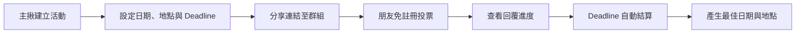

<h1 align="center">揪哪天?（Gathering Match）</h1>

<h3 align="center">擺脫科技冷漠！快速決定哪天、去哪裡，讓聚會不再停在群組訊息裡。</h3>

<p align="center">
  
  
  
  
</p>


> [!IMPORTANT]
> 本專案目前正在開發 MVP。Nuxt 前端流程為 Demo 狀態；ASP.NET Core Identity、第一批活動資料模型與 Supabase PostgreSQL Schema 已建立，但前後端尚未串接。

## 🚧 Current Progress

- Nuxt 3 前端已完成建立活動、確認地點、朋友投票與主揪回覆管理的 Demo 流程。
- ASP.NET Core 10 Web API 已完成 Identity、EF Core、Npgsql 與 User Secrets 基礎設定。
- Supabase PostgreSQL 已套用 `InitialIdentity`、`AddActivityPlanning`、`EnableRowLevelSecurity` 三個 Migration。
- 已建立 `ActivityType`、`City`、`District`、`Activity`、`DateOption`、`PlaceOption` 資料模型及關聯。
- Identity 與目前業務表均已啟用 RLS，不開放前端透過 Supabase Data API 直接存取。
- 已完成受 Identity 保護的「新增活動」API 第一條垂直流程。
- 六筆活動類型的 `SeedActivityTypes` Migration 已套用至 Supabase。
- 已確認台灣縣市／行政區官方代碼來源與匯入策略，詳見 `LOCATION_REFERENCE_DATA.md`。
- 已將完整 JSON 快照中的 22 個縣市與 368 個行政區透過 Transaction 匯入器寫入 Supabase，並以第二次執行確認不會重複新增。
- Development 環境可由 `http://localhost:5138/swagger` 開啟 Swagger UI。
- API 使用 `ApiResponse<T>` 統一成功與錯誤外層，並由全域 `IExceptionHandler` 處理未預期的伺服器錯誤。

詳細交接請見 [`PROJECT_STATUS.md`](./PROJECT_STATUS.md)。

<a id="vision"></a>

## ⚡ Product Vision

> ### 讓約人出去，不再需要一個很會揪的人。

朋友聚餐或旅行最常見的結局，不是大家都沒空，而是日期、餐廳和個人偏好散落在聊天訊息中；有人說「都可以」，有人已讀不回，最後沒有人願意整理並做決定。

**揪哪天?** 不只收集票數，而是在截止後根據已回覆資料主動提出最佳方案。即使仍有人沒有回覆，整場活動也不會被無限期卡住。

產品要解決的核心問題：

> **即使有人不積極參與，群體仍然能在期限內做出決定。**

<a id="quick-links"></a>

## 📖 Quick Links

- [為什麼需要這個產品？](#problem)
- [核心使用流程](#flow)
- [MVP 功能範圍](#mvp)
- [Group Match 成團演算法](#group-match)
- [初步資料模型](#data-model)
- [技術架構](#tech-stack)
- [開發 Roadmap](#roadmap)

<a id="problem"></a>

## 🎯 Why Gathering Match?

一般投票工具解決的是「怎麼收集大家的選項」，但一次聚會真正的阻力往往發生在投票之後。

| 問題 | 現實情況 | 揪哪天? 的處理方式 |
| --- | --- | --- |
| 📱 資訊分散 | 日期、餐廳連結與限制散落在聊天訊息中 | 將候選日期、地點與回覆集中在同一場活動 |
| 🧠 決策成本高 | 主揪必須人工整理每個人的偏好 | 系統比較各種日期與地點組合 |
| 💤 有人不回覆 | 全員未完成，投票就一直沒有結論 | Deadline 到期後依已回覆資料照常結算 |
| 🗳️ 最高票不等於共識 | 少數人很喜歡的選項可能讓其他人無法參加 | 優先尋找整體接受度較高的方案 |

### 成功不是「大家都投票了」

本產品最重要的指標是 **成團率（Formation Rate）**：

```text
成團率 = 成功產生日期、時間與地點的活動數 ÷ 已建立且到期的活動數
```

例如，100 場已到期活動中有 68 場成功產生完整方案，成團率就是 **68%**。

未成團也必須留下可分析的原因，例如無人回覆、日期沒有交集、地點缺乏共識，或主揪主動取消。這些資料會成為後續改善產品的依據。

<a id="flow"></a>

## 🚀 How It Works



### 1. 主揪建立活動

以「8 月姐妹聚餐」為例，主揪設定：

- 可行日期
- 預算範圍
- 地區與地點類型
- 3～5 個候選地點
- 投票截止時間

### 2. 分享活動連結

```text
8 月聚餐投票
24 小時後自動結算～
```

主揪可將連結貼至 LINE 或其他群組，不必再人工統計訊息。

### 3. 朋友免註冊投票

朋友開啟連結、輸入顯示名稱後即可參與。

| 日期偏好 | 地點偏好 |
| --- | --- |
| ✅ 可以 | 🤩 很想去 |
| 🤔 看情況 | 🙂 可以 |
| ❌ 不行 | 🙅 不想去 |

### 4. 查看回覆進度

```text
4 / 6 人已完成
剩餘 05:32:16
```

### 5. Deadline 自動結算

即使 Kevin 和 Amy 仍未投票，系統也會依照 4 位已回覆者的資料產生結果：

```text
🎉 最容易成團的方案

8/23 18:30
XXX 居酒屋

4 / 4 位已回覆者可以參加
Kevin、Amy 尚未回覆
```

<a id="mvp"></a>

## 🧩 MVP Scope

MVP（Minimum Viable Product，最小可行產品）要驗證的假設是：

> **Deadline 後自動提出最佳方案，能否降低主揪負擔並提高成團率？**

### V0.1 — 驗證成團流程

| 功能 | 說明 |
| --- | --- |
| 建立活動 | 輸入活動名稱、候選日期、預算、地區與地點類型 |
| 候選地點 | 主揪手動加入 3～5 個候選地點 |
| 分享連結 | 產生可傳至群組的活動網址 |
| 免註冊參與 | 朋友輸入顯示名稱後即可投票 |
| 日期與地點投票 | 分別記錄時間可行性及地點偏好 |
| 回覆進度 | 顯示已回覆人數與剩餘時間 |
| 自動結算 | Deadline 到期後不等待未回覆者 |
| 結果頁 | 顯示最佳方案、可參加者與未回覆者 |

### V0.2 — 加入真實地點推薦

主揪輸入預算、地區與地點類型後，系統透過 Google Places API 或其他地點資料來源推薦 3～5 個地點，再由主揪確認候選清單。

V0.1 先驗證最核心的成團機制；V0.2 才引入 API Key、費用、配額、搜尋規則及外部資料品質等額外變因。

### Not in V0.1

- 完整會員、好友與社群系統
- Google、LINE 或其他 OAuth 登入
- AI 餐廳推薦
- 群組聊天室
- 原生 iOS／Android App
- 複雜通知及多階段催票
- 進階個人化推薦

<a id="group-match"></a>

## 🧮 Group Match Algorithm

一般投票問的是：

> 哪個選項得到最多票？

Group Match 問的是：

> **哪一組日期與地點，最容易讓這群人真的成團？**

| 地點 | 成員評分 | 判讀 |
| --- | --- | --- |
| A | 5、1、1、1 | 一人非常喜歡，但其他人接受度低 |
| B | 4、4、4、4 | 沒有單一人的最高分，但整體接受度高 |

雖然地點 A 有一位強烈支持者，地點 B 才是比較穩定的團體解。

### 初步計算因素

- 日期可參與程度
- 地點整體接受度
- 明確反對或無法參加的人數
- 預算及地點條件符合度
- 已回覆人數與回覆率

```text
Group Match Score
= 日期可參與程度
× 地點接受程度
× 條件符合程度
× 回覆可信程度
```

第一版不追求複雜公式。演算法必須先做到三件事：**可解釋、可測試、不會被單一極端偏好扭曲。**

### 核心結算規則

1. 未回覆成員不阻塞結算。
2. 結果必須清楚標示計算所依據的回覆人數。
3. 日期與地點分開投票，結算時再組合成候選方案。
4. 「不行」與「不想去」是明確限制，不能只用總分掩蓋。
5. 沒有方案達到最低門檻時，應誠實顯示未成團，而不是強行選出結果。

<a id="data-model"></a>

## 🗂️ Data Model Draft

候選日期與地點不能被壓成 `Activity` 裡的一段文字，因為每位參加者需要對它們分別投票。

| Entity | Responsibility |
| --- | --- |
| `Activity` | 活動基本資料、預算、地區、截止時間與狀態 |
| `DateOption` | 可被投票的候選日期與時間 |
| `PlaceOption` | 可被投票的候選地點 |
| `Participant` | 參加者顯示名稱與回覆狀態 |
| `DateVote` | 參加者對特定日期的選擇 |
| `PlaceVote` | 參加者對特定地點的選擇 |
| `FormationResult` | 最終方案與計算摘要 |

> [!NOTE]
> `Activity`、`DateOption`、`PlaceOption` 及其參照資料已完成第一版；`Participant`、投票與結算模型仍是後續設計範圍。

<a id="tech-stack"></a>

## 🛠️ Tech Stack

| Layer | Technology | Why |
| --- | --- | --- |
| Frontend | Nuxt 3 + TypeScript + Tailwind CSS | 延續 Vue 3 Composition API，建立具型別與一致設計系統的前端 |
| Backend | C# / ASP.NET Core 10 Web API | 延續 .NET 經驗，建立可展示的後端核心 |
| ORM | Entity Framework Core Code First + Npgsql | 以 Migration 版本化管理 PostgreSQL Schema 與關聯資料 |
| Database | Supabase PostgreSQL（Free） | 使用託管 PostgreSQL 累積跨資料庫與雲端資料庫經驗 |
| API | RESTful API | 維持清楚的前後端契約與資源設計 |
| API Docs | Swagger / OpenAPI | 支援測試、契約檢查與作品展示 |
| Background Job | Hangfire 或 Quartz.NET | 在 Deadline 觸發結算；實作前依部署需求擇一 |
| Places | Google Places API（V0.2） | 根據地區、預算與類型建立真實地點候選 |
| Authentication | 後續評估 JWT / OAuth | V0.1 免註冊，會員系統不阻塞核心驗證 |
| Observability | `ILogger`；部署前評估 Elastic Stack | Container 輸出 ECS JSON 至 stdout／stderr，再集中收集與查詢 |
| Deployment | Supabase（Database）；前後端待評估 | 優先考量可重現、易維護與成本可控 |

<a id="roadmap"></a>

## 🗺️ Roadmap

- [x] 定義生活痛點與產品願景
- [x] 確認核心指標為 Formation Rate
- [x] 切分 V0.1 與 V0.2 功能範圍
- [x] 定義 Activity 與候選項目的第一版資料模型
- [ ] 定義參加者、投票與結算模型
- [ ] 建立 Group Match 測試案例與最低成團門檻
- [ ] 定義 RESTful API 契約
- [x] 建立 ASP.NET Core 10 Web API 範本專案
- [x] 建立 ASP.NET Core Identity 與 EF Core Migration 基礎
- [x] 將 Identity、活動規劃 Schema 與 RLS 套用至 Supabase PostgreSQL
- [x] 套用並驗證 `SeedActivityTypes` 活動類型參照資料
- [ ] 實作活動、投票與結算流程（新增活動 API 第一版已完成）
- [x] 建立 Nuxt 3 + TypeScript + Tailwind CSS 前端骨架
- [ ] 導入背景排程及整合測試
- [ ] 建立前後端 Docker 化與可重現的 Container 開發環境
- [ ] 將後端 Log 改為 ECS 結構化 JSON，輸出至 stdout／stderr
- [ ] 以 Elastic Agent／Filebeat 串接 Elasticsearch、Kibana，驗證以 `trace.id` 集中查詢
- [ ] 選定雲端後設定 Log 保存期限、Lifecycle Policy、敏感資料遮罩與告警
- [ ] 部署可供真人測試的 MVP
- [ ] 串接真實地點推薦

## 💼 Portfolio Highlights

這個專案預計展示：

- 從生活問題提煉需求、產品規則與成功指標
- Nuxt 3、TypeScript、Tailwind CSS 與 ASP.NET Core 前後端整合
- PostgreSQL 關聯式資料建模、EF Core Migration 與 RESTful API 設計
- 可解釋、可測試的群體決策演算法
- Deadline 背景工作與自動結算流程
- 測試、API 文件、部署方式及非同步協作文件
